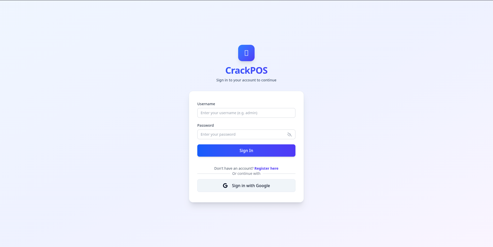
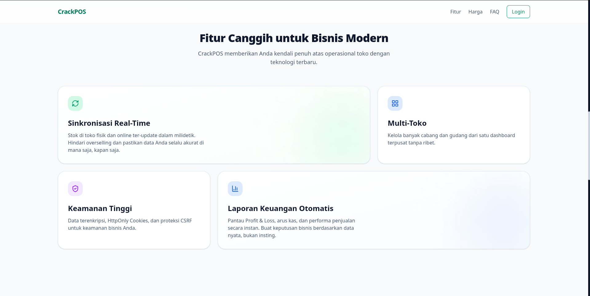

# 💎 CrackPOS — Frontend

Frontend untuk sistem **Inventory Management & Point of Sale (POS)**, dibangun dengan **Next.js 16 App Router** dan terintegrasi dengan backend NestJS.

## Asset Preview

### FE-1 — Halaman Login


Tampilan awal halaman login aplikasi CrackPOS. Digunakan untuk autentikasi admin/staff sebelum mengakses dashboard.

### FE-2 — Dashboard Admin


Halaman utama web aplikasi CrackPOS setelah login. Berisi overview statistik toko (total produk, stok, revenue, low stock), menu navigasi sidebar, dan akses ke seluruh fitur manajemen (produk, kategori, supplier, PO, returns, laporan, dsb).

## Tech Stack

| Layer | Teknologi |
|---|---|
| Framework | Next.js 16 (App Router, Turbopack) |
| Bahasa | TypeScript 5 (strict mode) |
| Styling | Tailwind CSS 4 |
| State Management | Zustand (client cart) |
| Server Data | TanStack React Query |
| Forms | React Hook Form + Zod |
| Auth Gateway | `middleware.ts` (Edge) |
| JWT Verify | jose |

## Fitur

### Admin Dashboard (`/dashboard/admin/*`)
- **Overview** — Statistik toko (total produk, stok, revenue, low stock)
- **Products** — CRUD produk, search, kategori
- **Categories** — CRUD kategori
- **Suppliers** — CRUD supplier
- **Purchase Orders** — Buat & manage PO, receive stock otomatis
- **Returns** — Catat retur barang
- **Transactions** — Riwayat transaksi penjualan
- **Reports** — Sales Report, Inventory Report, Profit & Loss (dengan filter tanggal & export CSV)
- **Inventory** — Adjust stok (damaged/lost/found/manual)
- **Employees** — Manage user (admin/staff)
- **Activity Log** — Audit trail (siapa ngapain kapan)
- **AI Product Input** — Upload gambar produk, AI ekstrak detail otomatis

### Cashier / POS (`/dashboard/cashier`)
- Terminal POS dengan grid produk + cart sidebar (Zustand)
- Checkout dengan quantity management
- Riwayat transaksi kasir

### Auth
- Login dengan JWT (cookie-based)
- Register toko baru
- Google OAuth
- Super Admin panel

## Struktur Proyek

```
src/
├── app/                            # Next.js App Router
│   ├── (auth)/login/               # → /login
│   ├── (auth)/create-store/        # → /create-store
│   ├── dashboard/admin/*           # → /dashboard/admin/...
│   ├── dashboard/cashier/          # → /dashboard/cashier
│   ├── super-admin/                # → /super-admin/...
│   └── layout.tsx                  # Root layout
│
├── components/                     # Shared UI
│   ├── ui/                         # Button, Input, Modal, DataTable
│   └── layouts/                    # Sidebar, DashboardHeader
│
├── features/                       # Domain logic per fitur
│   ├── auth/                       # Login form, mutation, Google OAuth
│   ├── products/                   # CRUD, search, form
│   ├── sales/                      # Cart (Zustand store), checkout
│   ├── purchase-orders/            # PO form, list, detail
│   ├── reports/                    # Sales, Inventory, Profit & Loss
│   ├── activity-log/               # Audit trail table + filter
│   └── ...                         # categories, suppliers, returns, etc
│
├── infrastructure/                 # Global utilities
│   ├── api/                        # API client, CSRF, types
│   └── utils/                      # Constants, formatter (IDR)
│
└── middleware.ts                   # Auth gateway (JWT + RBAC)
```

## Route Map

| Route | Akses | Deskripsi |
|---|---|---|
| `/login` | Public | Halaman login |
| `/register` | Public | Registrasi |
| `/create-store` | Public | Buat toko baru |
| `/dashboard/admin` | Admin | Overview dashboard |
| `/dashboard/admin/products` | Admin | Manajemen produk |
| `/dashboard/admin/categories` | Admin | Manajemen kategori |
| `/dashboard/admin/suppliers` | Admin | Manajemen supplier |
| `/dashboard/admin/purchase-orders` | Admin | Purchase orders |
| `/dashboard/admin/returns` | Admin | Retur barang |
| `/dashboard/admin/transactions` | Admin | Riwayat transaksi |
| `/dashboard/admin/reports` | Admin | Laporan (sales/inventory/profit-loss) |
| `/dashboard/admin/inventory` | Admin | Adjust stok |
| `/dashboard/admin/employees` | Admin | Kelola pegawai |
| `/dashboard/admin/activity-log` | Admin | Catatan aktivitas |
| `/dashboard/admin/ai-product` | Admin | Input produk via AI |
| `/dashboard/cashier` | Staff | Terminal POS |
| `/dashboard/cashier/transactions` | Staff | Riwayat transaksi kasir |
| `/super-admin/login` | Public | Login super admin |
| `/super-admin/dashboard` | Super Admin | Panel super admin |
| `/super-admin/tenants` | Super Admin | Kelola tenant |

## Persiapan

### Prerequisites

- Node.js 20+
- Bun atau npm

### Install

```bash
bun install
# atau
npm install
```

### Environment Variables

Buat `.env.local`:

```env
# Backend API
NEXT_PUBLIC_API_URL=http://localhost:8080

# AI Service
NEXT_PUBLIC_AI_URL=http://localhost:8001

# JWT Secret (harus sama dengan backend)
JWT_SECRET=crackpos-jwt-secret-k3y-2026-very-strong-random
```

> File `.env.local` untuk development lokal, `.env.docker` untuk environment Docker.

### Development

```bash
npm run dev
# atau
bun run dev
```

Akses [http://localhost:3000](http://localhost:3000).

### Production Build

```bash
npm run build
npm run start
```

## Integrasi Backend

### Format Response

Semua API backend NestJS menggunakan format:

```json
{
  "statusCode": 200,
  "message": "Success",
  "data": { ... },
  "timestamp": "2026-01-01T00:00:00.000Z"
}
```

Frontend `apiClient` otomatis extract `data` dari response wrapper.

### Pagination

Endpoint dengan pagination return:

```json
{
  "data": [ ... ],
  "total": 50
}
```

### Idempotency

Mutation request otomatis attach `Idempotency-Key` header (UUID) untuk mencegah duplikasi transaksi.

### Query Params

Filter, search, dan pagination pakai URL search params (`?page=1&search=...`), bukan client state.

## Cart System (Zustand)

Cart di `src/features/sales/store/useCartStore.ts`:

| Method | Deskripsi |
|---|---|
| `addItem(product)` | Tambah produk (atau increment qty) |
| `removeItem(productId)` | Hapus item |
| `updateQuantity(productId, qty)` | Set qty |
| `clearCart()` | Kosongkan cart |
| `getTotalPrice()` | Total harga |
| `getItemCount()` | Total item |

## Test Coverage

| Metrik | Value |
|--------|-------|
| **Total Unit Test Coverage** | **>88%** |
| Test Files | **36 files** (129 tests) |
| Framework | Vitest v4 + React Testing Library |

### Coverage Detail

| Metric | % |
|--------|---|
| Statements | **88.23%** |
| Functions | **90.24%** |
| Lines | **90.74%** |
| Branches | **63.15%** |

### Test Scope

| Category | Files Tested |
|---|---|
| **Utils** | `formatCurrency`, `downloadCsv`, `constants` |
| **API Client** | `csrf`, `adminClient`, `aiClient` |
| **Zod Schemas** | `login`, `register`, `product`, `salesOrder`, `purchaseOrder`, `return`, `changePassword` |
| **Store** | `useCartStore` (Zustand) |
| **Hooks** | Auth, Products, Categories, Suppliers, Sales, Purchase Orders, Returns, Reports, Inventory, Employees, Activity Log, Change Password, AI Chat, Notifications, Admin |

### Run Tests

```bash
npm run test        # Run all tests
npm run test:watch  # Watch mode
npm run coverage    # Coverage report
```

## Scripts

```bash
npm run dev      # Dev server (port 3000)
npm run build    # Production build
npm run start    # Start production server
npm run lint     # ESLint
npm run test     # Vitest
npm run test:watch # Vitest watch
npm run coverage # Vitest coverage report
```

## Lisensi

Bagian dari proyek final Crack.
